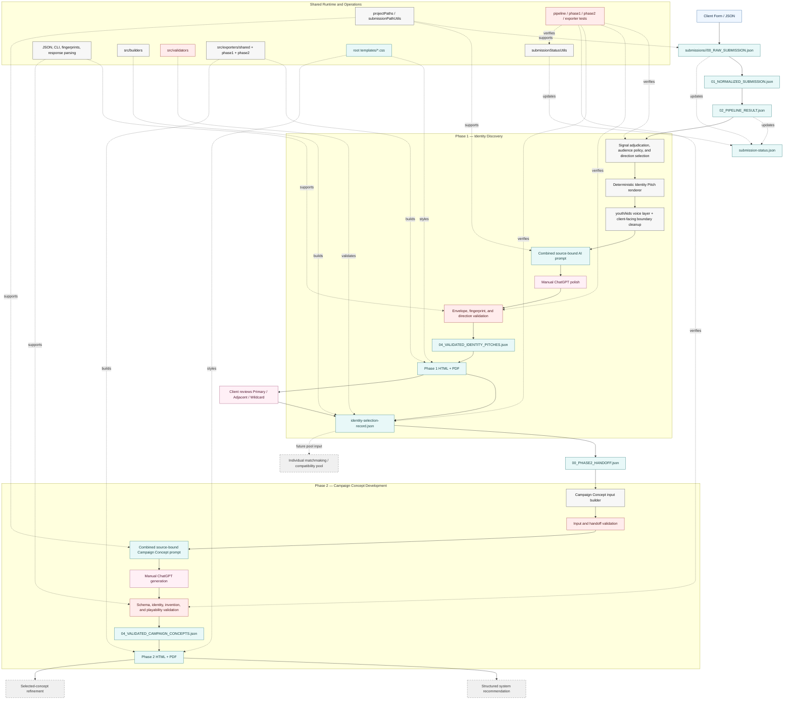

# QuestForge Campaign Distillery — Program Architecture

← [Back to Developer Documentation](../README.md)

## Scope

This document describes the implemented v0.10.0 architecture.

Solid workflow stages are implemented. Dashed downstream stages remain planned.

## Architecture Diagram



## Major Architectural Boundaries

### Authoritative records versus generated artifacts

```text
submissions/
→ durable intake, deterministic records, and lifecycle status

exports/
→ prompts, responses, validation reports, selected identity records, previews, and PDFs
```

### Phase boundary

```text
validated Identity Pitches
→ human selection
→ Identity Selection Record
→ Phase 2 handoff
→ Campaign Concept generation
```

### Runtime versus presentation

```text
src/ai
→ generation and validation contracts

src/builders and src/validators
→ reusable structured artifact construction and validation

src/exporters
→ normalization and document generation

templates
→ visual presentation

scripts
→ operator commands
```

## Implemented Components

- deterministic Phase 1 pipeline;
- Core Frame audience policy;
- youth/kids voice layer;
- client-facing phrase boundary cleanup;
- combined Phase 1 AI round trip;
- Identity Pitch validation;
- Phase 1 HTML/PDF export;
- Identity Selection Record builder and validator;
- Phase 2 handoff from Identity Selection Record;
- Campaign Concept contract and schema;
- combined Phase 2 AI round trip;
- Campaign Concept validation;
- Phase 2 HTML/PDF export;
- canonical submission/export paths;
- shared submission lifecycle status;
- shared script infrastructure;
- categorized tests;
- generated developer wiki.

## Planned Components

- system recommendation;
- selected-concept finalization;
- automated form and email transport;
- individual-player matchmaking and compatibility pools.
